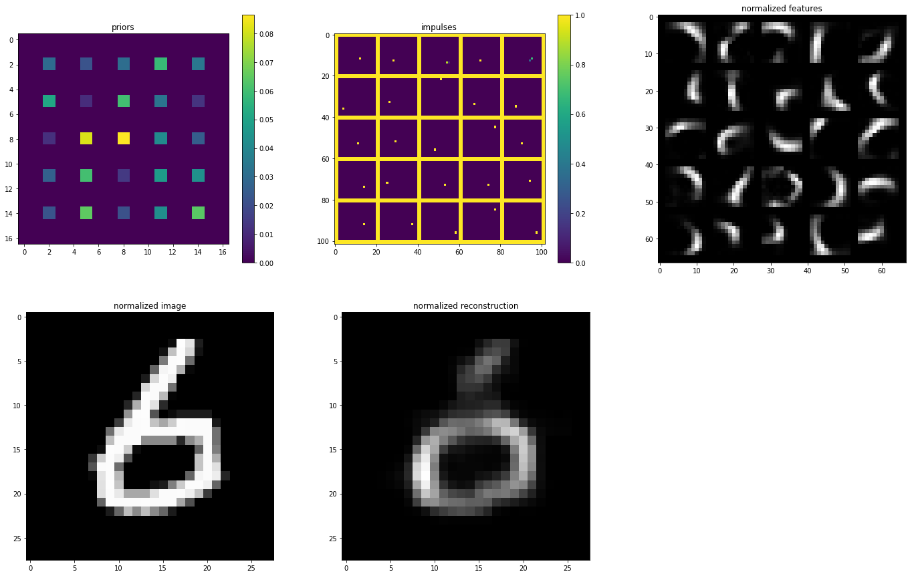

# Deep PLCA
Deep probabilistic latent component analysis



### Abstract
Shift-invariant probabilistic latent component analysis (PLCA) introduced by Smaragdis and Raj [2007] is a decomposition algorithm that is largely motivated by a need to intuitively and efficiently decompose image data. Other decomposition methods such as non-negative matrix factorization (NMF) and principal component analysis (PCA) cannot capture features that are spatially invariant. In other words, features such as "edges" or "shapes" may require multiple feature representations if they occur at different locations. 

We present a new algorithm for shift-invariant PLCA that in addition to achieving the same reconstruction performance, has two key advantages: 1.) it generalizes to unseen data, 2.) it converges faster. Instead of using an expectation-maximization (EM) algorithm, our method uses a deep convolutional neural network (CNN) and gradient descent to optimize over a linear combination of the reconstruction loss of the approximated data and entropy loss of the latent components. Hence, we name our method Deep PLCA. 

### Example usage
```
python main.py --data=mnist --prob --imsize=28 --model=deep-plca --nkern=15 --kern-size=7 --opt=adam --bsz=512 --lr=1e-1 --epochs=1 --recon=ce --beta1=0 --beta2=2 --beta3=0
```
Runs deep PLCA on MNIST, whose images have been converted to probability distributions. It specifies 15 components whose features are 7x7. It uses the Adam optimizer with batch size 512, learning rate 0.1, and 1 epoch. The reconstruction loss is set to cross entropy, with prior, impulse and kernel entropy weight losses set to 0, 2, 0 respectively.

See the `main.py` file to see the full list of arguments and their descriptions.
